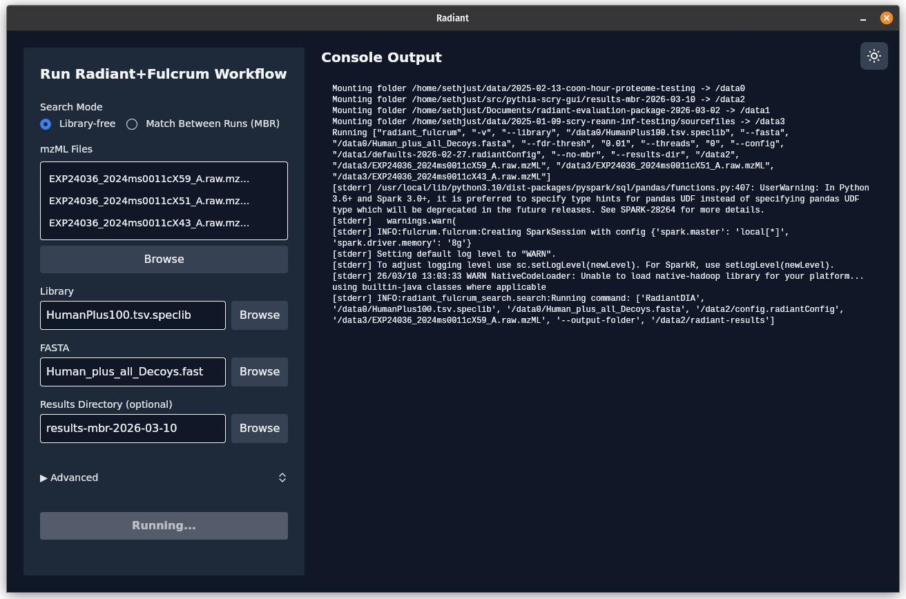

# ✨ Pythia+Scry GUI

A friendly, cross-platform GUI for running powerful proteomics workflows with ease. Built with Rust and Dioxus. 🚀

---

---

## 🧬 What is this?

This is a modern desktop and web app for processing DIA proteomics data using Pythia+Scry workflows running in Docker.
No command-line expertise needed!
Whether you're a bioinformatician or a biologist just getting started, this tool makes complex data analysis simple and fast.

## 🌟 Key Features

- **Run Pythia+Scry workflows**: Supports both "library-free" and MBR workflows using Docker
- **Cross-platform**: Works on Windows, macOS, and Linux
- **Intuitive file browser**: Select input/output locations easily. Remembers your last-used library and FASTA
- **Customizable CLI form**: Adjust workflow options without editing config files
- **Light/dark theme**: Pick what looks best to you
- **Fast setup**: Get started in minutes
- **Actively supported**: See our [discussions](https://github.com/seerbio/pythia-scry-gui/discussions) and [issue tracker](https://github.com/seerbio/pythia-scry-gui/issues)

## 🚀 Quick Start

1. **Download**: Grab the latest release for your platform from [Releases](https://github.com/seerbio/pythia-scry-gui/releases)  
2. **Install Docker**: [Docker installation guide](https://docs.docker.com/get-docker/)  
   _Docker is required to run workflows._
3. **Launch the App**: Double-click the downloaded file to launch
4. **Select your data**: Use the file browser to choose your input files and output location.
   All you need is MS data files (`mzML` format), a spectral library (predicted is best!) and a FASTA database.
5. **Configure & Run**: Set up your parameters, hit "Run", and watch your analysis go!

## 📚 Documentation & Help

- [User Guide](#) _(coming soon)_
- [FAQ](#frequently-asked-questions)
- [Support](https://github.com/seerbio/pythia-scry-gui/discussions) & [Issues](https://github.com/seerbio/pythia-scry-gui/issues)

## 🤝 Get Involved

- **Feature requests?** [Start a discussion](https://github.com/seerbio/pythia-scry-gui/discussions)
- **Found a bug?** [Report it here](https://github.com/seerbio/pythia-scry-gui/issues)
- **Questions?** [Contact us](https://github.com/seerbio/pythia-scry-gui/discussions)

## Frequently Asked Questions

### What files do I need?

You'll need:
- MS data files in `mzML` format
- A spectral library (predicted libraries work best)
- A FASTA database

### Can I use this for library-free searches?

Absolutely! The app supports both library-free and MBR (match-between-runs) workflows.

### Why do I need to pick a library file in "library-free" mode?

"Library-free" mode allows you to analyze DIA proteomics data without having to collect data or do data processing
to build a library first. This still requires a source of peptide information and expected spectral patterns, which
can be generated from a FASTA using a tool like [AlphaPeptDeep](https://github.com/MannLabs/alphapeptdeep),
[Prosit](https://www.proteomicsdb.org/prosit/), or [DIA-NN](https://github.com/vdemichev/DiaNN).

Pythia can also use libraries in TSV format from other tools like Skyline, EncyclopeDIA, or DIA-NN.

### Does this work on my operating system?

Yes! The app runs on Windows, macOS, and Linux.

### Does this work on my M-series Mac?

Yes! This app, Pythia, and Scry are all designed to run natively on ARM processors like the Apple M-series.

### Does this work on my older Intel Mac?

Yes! We also provide an Intel build for Mac.

### Do I need to install anything besides the app?

You'll need Docker installed to run the workflows. [Get Docker here](https://docs.docker.com/get-docker/).

### Where does my data go?

All processing happens locally in Docker containers on your machine. You choose where output files are saved.

### The app isn't working. Where can I get help?

Check out our [issue tracker](https://github.com/seerbio/pythia-scry-gui/issues) or start a [discussion](https://github.com/seerbio/pythia-scry-gui/discussions). We're here to help!
